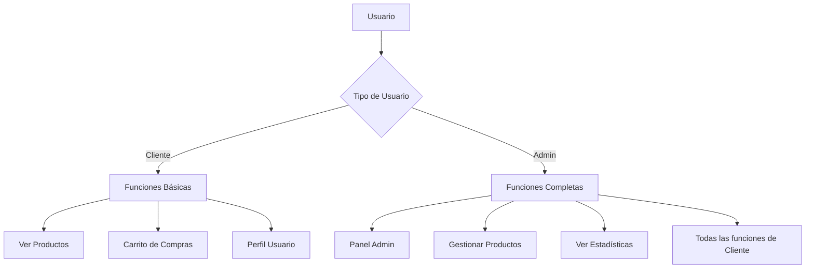

# 🐉 DragonTech - Tienda de Laptops Gaming

<div align="center">
  
  
  
  
  
</div>

<div align="center">
  <h3>🎮 Tu tienda de laptops gaming de confianza</h3>
  <p>Una plataforma moderna de ecommerce especializada en laptops gaming con interfaz futurista y funcionalidades completas</p>
</div>

---

## 📋 Tabla de Contenidos

- [🌟 Características](#-características)
- [🔧 Tecnologías Utilizadas](#-tecnologías-utilizadas)
- [⚡ Instalación Rápida](#-instalación-rápida)
- [🗃️ Configuración de Base de Datos](#️-configuración-de-base-de-datos)
- [👑 Usuarios por Defecto](#-usuarios-por-defecto)
- [🎯 Funcionalidades](#-funcionalidades)
- [📱 Capturas de Pantalla](#-capturas-de-pantalla)
- [🔐 Sistema de Roles](#-sistema-de-roles)
- [🛒 Sistema de Carrito](#-sistema-de-carrito)
- [📁 Estructura del Proyecto](#-estructura-del-proyecto)
- [🚀 Uso](#-uso)
- [🔒 Seguridad](#-seguridad)
- [🎨 Personalización](#-personalización)
- [📈 Próximas Mejoras](#-próximas-mejoras)
- [🤝 Contribución](#-contribución)

---

## 🌟 Características

### ✨ **Diseño y UX**
- 🎮 **Tema gaming futurista** con efectos neón y animaciones CSS
- 📱 **Diseño responsive** adaptable a todos los dispositivos
- 🌙 **Esquema de colores dark** optimizado para gaming
- ⚡ **Interfaz intuitiva** con navegación fluida

### 🛍️ **Funcionalidades de Tienda**
- 🔍 **Búsqueda avanzada** con filtros por marca, precio y texto
- 📋 **Catálogo completo** con ordenamiento múltiple
- 🛒 **Carrito de compras** con gestión en tiempo real
- 💳 **Cálculo automático** de precios, impuestos y envío
- 📄 **Páginas de detalles** con especificaciones técnicas

### 🔐 **Sistema de Administración**
- 👑 **Panel de administración** exclusivo para admins
- 📊 **Dashboard con estadísticas** de productos y usuarios
- ➕ **Gestión de productos** (crear, editar, eliminar)
- 🖼️ **Sistema de subida de imágenes** con validación
- 👥 **Control de acceso basado en roles**

---

## 🔧 Tecnologías Utilizadas

### **Backend**
- **PHP 8+** - Lógica del servidor
- **MySQL** - Base de datos relacional
- **PDO/MySQLi** - Conexión segura a la base de datos

### **Frontend**
- **HTML5** - Estructura semántica
- **CSS3** - Estilos y animaciones avanzadas
- **JavaScript (Vanilla)** - Interactividad del cliente
- **Font Awesome** - Iconografía moderna
- **Google Fonts** - Tipografías gaming (Orbitron, Rajdhani)

### **Seguridad**
- **Password Hashing** - Bcrypt para contraseñas
- **Prepared Statements** - Prevención de SQL injection
- **Session Management** - Manejo seguro de sesiones
- **Input Validation** - Validación y sanitización de datos

---

## ⚡ Instalación Rápida

### **Prerrequisitos**
- 🔥 **XAMPP, WAMP o LAMP** (PHP 7.4+, MySQL 5.7+)
- 🌐 **Navegador web moderno**
- 📝 **Editor de código** (opcional)

### **Pasos de Instalación**

1. **Clonar el repositorio**
   ```bash
   git clone https://github.com/Alejandro05120hernandez/DragonByte-pagina-web2.git
   cd DragonByte-pagina-web2
   ```

2. **Mover a directorio web**
   ```bash
   # Para XAMPP (Windows)
   cp -r * C:/xampp/htdocs/DragonByte-pagina-web2/
   
   # Para LAMP (Linux)
   sudo cp -r * /var/www/html/DragonByte-pagina-web2/
   ```

3. **Iniciar servicios**
   - Abrir **XAMPP Control Panel**
   - Iniciar **Apache** y **MySQL**

4. **Configurar base de datos** (ver sección siguiente)

5. **Acceder a la aplicación**
   ```
   http://localhost/DragonByte-pagina-web2
   ```

---

## 🗃️ Configuración de Base de Datos

### **Método 1: phpMyAdmin (Recomendado)**
1. Ir a `http://localhost/phpmyadmin`
2. Crear nueva base de datos: `dragontech_db`
3. Importar el archivo `dragontech_db.sql`

### **Método 2: Línea de comandos**
```bash
mysql -u root -p
CREATE DATABASE dragontech_db;
USE dragontech_db;
SOURCE dragontech_db.sql;
```

### **Configuración de conexión**
El archivo `db.php` contiene la configuración por defecto:
```php
$host = "localhost";
$user = "root"; 
$pass = "";
$db = "dragontech_db";
```

---

## 👑 Usuarios por Defecto

### **Administrador**
```
👤 Usuario: admin_dragon
🔑 Contraseña: admin123
🎭 Rol: Administrador
```

### **Crear usuario admin**
Ejecutar el script: `http://localhost/DragonByte-pagina-web2/create_admin.php`

> ⚠️ **Importante**: Cambiar las contraseñas por defecto en producción

---

## 🎯 Funcionalidades

### **Para Clientes** 👤
| Funcionalidad | Descripción |
|--------------|-------------|
| 🏠 **Página Principal** | Vista de productos destacados |
| 📱 **Catálogo** | Explorar todos los productos con filtros |
| 🔍 **Búsqueda** | Filtrar por nombre, marca, precio |
| 📄 **Detalles** | Especificaciones técnicas completas |
| 🛒 **Carrito** | Agregar, modificar y gestionar compras |
| 👤 **Cuenta** | Registro y gestión de perfil |

### **Para Administradores** 👑
| Funcionalidad | Descripción |
|--------------|-------------|
| 📊 **Dashboard** | Estadísticas y métricas de la tienda |
| ➕ **Agregar Productos** | Formulario completo con validaciones |
| 🗑️ **Eliminar Productos** | Gestión segura del inventario |
| 👥 **Ver Usuarios** | Lista de clientes registrados |
| 🖼️ **Gestión de Imágenes** | Subida y organización de fotos |

---

## 📱 Capturas de Pantalla

### 🏠 **Página Principal**
- Hero section con efectos visuales
- Grid de productos destacados
- Navegación intuitiva

### 📱 **Catálogo de Productos**
- Filtros avanzados por marca y precio
- Ordenamiento múltiple
- Cards de productos optimizadas

### 🛒 **Carrito de Compras**
- Gestión de cantidades en tiempo real
- Cálculo automático de totales
- Resumen de pedido detallado

### 👑 **Panel de Administración**
- Dashboard con estadísticas
- Gestión completa de productos
- Interface administrativa profesional

---

## 🔐 Sistema de Roles

### **Arquitectura de Permisos**



### **Niveles de Acceso**
| Rol | Permisos | Páginas Exclusivas |
|-----|----------|-------------------|
| **Cliente** | Ver productos, carrito, perfil | `home.php`, `laptops.php`, `carrito.php` |
| **Admin** | Gestión completa + funciones de cliente | `admin.php`, `add-laptop.php` |

---

## 🛒 Sistema de Carrito

### **Funcionalidades del Carrito**
- ✅ **Agregar productos** con AJAX
- ✅ **Actualizar cantidades** dinámicamente
- ✅ **Eliminar productos** individuales
- ✅ **Vaciar carrito** completo
- ✅ **Contador en tiempo real** en navegación
- ✅ **Cálculos automáticos** (subtotal, impuestos, envío)
- ✅ **Envío gratis** para compras >$1000

### **API del Carrito**
| Endpoint | Método | Descripción |
|----------|--------|-------------|
| `add_to_cart.php` | POST | Agregar producto al carrito |
| `get_cart_count.php` | GET | Obtener cantidad de items |
| `carrito.php` | GET/POST | Página principal del carrito |

---

## 📁 Estructura del Proyecto

```
DragonByte-pagina-web2/
├── 📄 index.php              # Página de login
├── 🏠 home.php               # Página principal
├── 📱 laptops.php            # Catálogo completo
├── 🔍 view_laptop.php        # Detalles de producto
├── 🛒 carrito.php            # Carrito de compras
├── 👑 admin.php              # Panel de administración
├── ➕ add-laptop.php         # Agregar productos (admin)
├── 🗑️ delete_laptop.php      # Eliminar productos (admin)
├── 👤 register.php           # Registro de usuarios
├── 🚪 logout.php             # Cerrar sesión
├── 🔐 auth.php               # Sistema de autenticación
├── 🗃️ db.php                 # Configuración de BD
├── 🎨 style.css              # Estilos principales
├── 📊 dragontech_db.sql      # Base de datos
├── 🖼️ uploads/               # Imágenes de productos
├── 🖼️ img/                   # Imágenes del sitio
├── 🛒 add_to_cart.php        # API del carrito
├── 📊 get_cart_count.php     # Contador del carrito
├── 👑 create_admin.php       # Script crear admin
└── 📖 README.md              # Documentación
```

---

## 🚀 Uso

### **Para Clientes**
1. **Registrarse** en `register.php`
2. **Explorar productos** en `laptops.php`
3. **Ver detalles** haciendo clic en productos
4. **Agregar al carrito** y **gestionar compras**

### **Para Administradores**
1. **Iniciar sesión** con credenciales de admin
2. **Acceder al panel** desde la navegación
3. **Gestionar productos** desde `admin.php`
4. **Ver estadísticas** y **agregar nuevos productos**

---

## 🔒 Seguridad

### **Medidas Implementadas**
- 🔐 **Hashing de contraseñas** con bcrypt
- 🛡️ **Prepared statements** para prevenir SQL injection
- 🔍 **Validación de entrada** en todos los formularios
- 🖼️ **Validación de archivos** para subida de imágenes
- 👥 **Control de sesiones** y autenticación
- 🎭 **Verificación de roles** en páginas protegidas

### **Recomendaciones de Producción**
```php
// Cambiar credenciales por defecto
$admin_password = "contraseña_segura_aqui";

// Configurar HTTPS
$secure_connection = true;

// Validar origen de requests
$allowed_origins = ["https://tudominio.com"];
```

---

## 🎨 Personalización

### **Variables CSS Principales**
```css
:root {
    --primary: #ff3864;        /* Color principal */
    --secondary: #00d9ff;      /* Color secundario */
    --accent: #7e42ff;         /* Color de acento */
    --bg-primary: #0a0a12;     /* Fondo principal */
    --text-primary: #ffffff;   /* Texto principal */
}
```

### **Personalizar Tema**
1. Editar variables en `style.css`
2. Cambiar tipografías en las importaciones
3. Modificar animaciones CSS
4. Ajustar layout responsive

---

## 📈 Próximas Mejoras

### **Funcionalidades Pendientes**
- [ ] 💳 **Integración de pagos** (Stripe, PayPal)
- [ ] 📧 **Sistema de emails** (confirmaciones, facturas)
- [ ] 📦 **Gestión de pedidos** y estados
- [ ] ⭐ **Sistema de reseñas** y calificaciones
- [ ] 📊 **Analytics avanzados** de ventas
- [ ] 🔍 **Búsqueda con autocompletado**
- [ ] 📱 **App móvil** (React Native/Flutter)
- [ ] 🌐 **Internacionalización** (multi-idioma)

### **Mejoras Técnicas**
- [ ] 🔄 **API REST** completa
- [ ] 📝 **Sistema de logs** avanzado
- [ ] 🔒 **Autenticación 2FA**
- [ ] 📊 **Cache de consultas**
- [ ] 🧪 **Testing automatizado**

---

## 🤝 Contribución

### **Cómo Contribuir**
1. **Fork** el repositorio
2. **Crear rama** para nueva funcionalidad
   ```bash
   git checkout -b feature/nueva-funcionalidad
   ```
3. **Hacer commits** descriptivos
   ```bash
   git commit -m "✨ Agregar sistema de reseñas"
   ```
4. **Push** a la rama
   ```bash
   git push origin feature/nueva-funcionalidad
   ```
5. **Crear Pull Request**

### **Estándares de Código**
- 📝 **PSR-12** para PHP
- 🎨 **BEM** para CSS
- 📖 **JSDoc** para JavaScript
- 🧪 **Testing** para nuevas funcionalidades

---

## 📞 Soporte y Contacto

### **Información del Proyecto**
- 👨‍💻 **Desarrollador**: Alejandro Hernández
- 🐙 **GitHub**: [@Alejandro05120hernandez](https://github.com/Alejandro05120hernandez)
- 📧 **Email**: [contacto@dragontech.com](mailto:contacto@dragontech.com)
- 🌐 **Sitio Web**: [DragonTech Store](http://localhost/DragonByte-pagina-web2)

### **Reportar Issues**
Si encuentras algún bug o tienes sugerencias:
1. 🐛 **Crear issue** en GitHub
2. 📝 **Describir el problema** detalladamente
3. 🖼️ **Incluir capturas** si es necesario
4. 🏷️ **Usar labels** apropiados

---

<div align="center">
  
### 🐉 **¡Gracias por usar DragonTech!**

**Si este proyecto te fue útil, no olvides darle una ⭐ en GitHub**

---

*Hecho con ❤️ por desarrolladores gamers para la comunidad gaming*

</div>